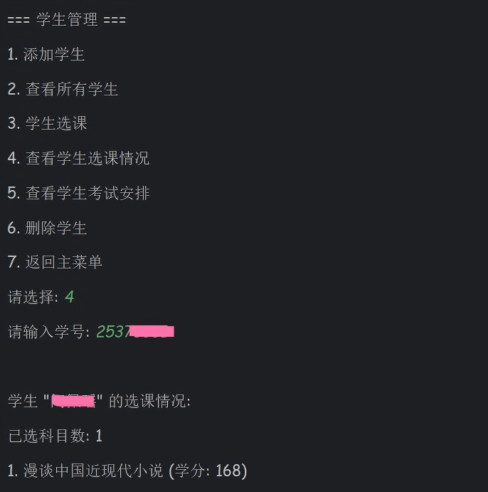
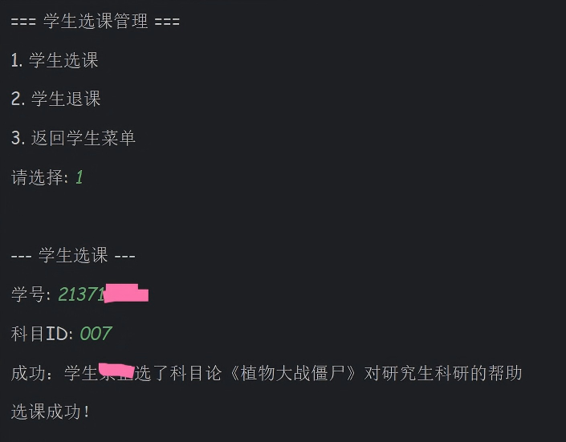
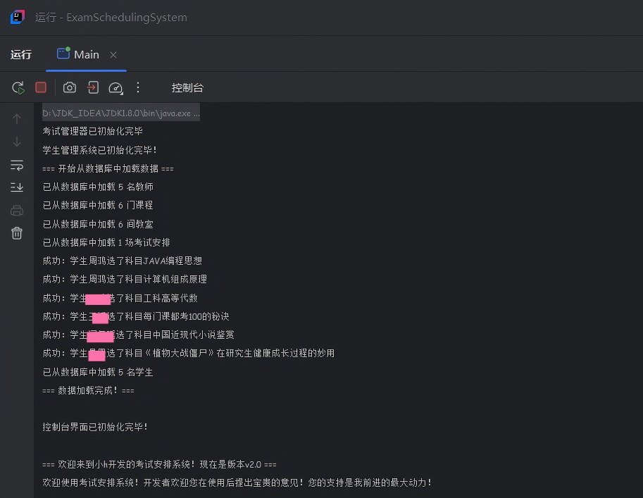

# 关于《学生选课与考试管理系统》开发的说明

24371313 周鸿

作为我的《Java编程思想》的结课大作业，这是一个学生选课管理和考试安排的系统，基于Java3.24版本实现。这个项目能够满足的需求包括**教师信息管理，学生信息管理，学生选课管理，考试安排管理**等。

整个项目经过了3次迭代。第一版实现了一个基础的信息管理系统，已经具备全部的功能，支持学生选课和安排考试。第2版在第一版的基础上添加了数据库。我分别用几个txt文件存放学生，老师，教室，课程及考试安排的信息，然后添加了FileDataLoader类，来专门读取文件中的数据到系统中，**这样就实现了数据和程序的分离，降低了整个项目的耦合度**。由于实现的难度，我在第二次迭代中并没有做数据记忆功能。这就是说在控制台输入的修改信息只保存在了这个正在运行的系统里，运行结束以后这些数据就被清空。数据记忆功能需要考虑**输入信息后覆写文件对正在运行的系统的影响**，相对难度较大，考虑到时间问题，这个功能我想留到后续再进行开发。第三版在前面的基础上完成了前端页面的设计，并分离出学生入口，老师入口和管理员入口。在学生的界面上可以查看自己的选课情况和考试安排，并完成选课退课的操作。在老师的界面上可以查看自己的监考安排。管理员界面可以对系统进行管理，安排具体的考试任务，修改人员和课程信息等。以下分别对这三版代码进行说明。

## ExamScheduleSystem版本1.0开发说明

第一版的项目结构如下：

```text
examSchedulingSystem/     # 项目文件夹
├── src/                   # 所有源代码
│   ├── Main.java
│   ├── Teacher.java
│   ├── Student.java
│   ├── Subject.java
│   ├── Classroom.java
│   ├── ExamSchedule.java
│   ├── ExamManager.java
│   ├── StudentManager.java
│   ├── InMemoryStorage.java
│   └── ConsoleUI.java
└── README.txt            # 简单说明
```

打开Main.java后运行，可以看到系统初始化完成后给出的提示信息：

```text
正在启动用户界面...
控制台界面已初始化

=== 考试安排系统 v1.0 ===
欢迎使用考试安排系统！

=== 主菜单 ===
1. 教师管理
2. 科目管理
3. 教室管理
4. 考试安排管理
5. 学生管理
6. 查看所有数据
7. 系统统计
0. 退出系统
=============
请选择操作: 
```

输入对应的数字即可进入相应的选项进行操作。以下学生查询选课情况的一个输出的截图：

<div >
    
</div>

以下是学生进行选课的一个输出：

<div>
    
</div>

这些学生和课程的信息是在Main.java中初始化就加载进系统的。这两门课程当然都是我用来测试虚构的哈，不涉及任何隐私或信息泄漏的问题。由于在迭代开发过程中，我直接在第1版代码的基础上进行了修改，因此只能用截图的方式来展示控制台的输入输出了。

## ExamScheduleSystem版本2.0开发说明

为了说明进行第二版开发的目的和优势，我先给出第一版中Main.java的部分代码：

```java
private static void initializeSampleData(ExamManager examManager, StudentManager studentManager) {
        // 创建示例教师
        Teacher teacher1 = new Teacher("T001", "张明", "计算机学院");
        examManager.addTeacher(teacher1);
        
        // 创建示例科目
        Subject subject1 = new Subject("S001", "Java程序设计", 3);
        examManager.addSubject(subject1);
        
        // 创建示例教室
        Classroom classroom1 = new Classroom("3312", "三教312", 88);
        examManager.addClassroom(classroom1);
        
        // 创建示例考试安排
        LocalDateTime examTime1 = LocalDateTime.of(2025, 12, 16, 9, 0);
        
        ExamSchedule exam1 = new ExamSchedule("E001", subject1, examTime1, classroom1, teacher1, 120);
        examManager.scheduleExam(exam1);
        
        // 创建示例学生
        Student student1 = new Student("ST001", "小h");
        
        studentManager.addStudent(student1);
        
        // 学生选课
        studentManager.enrollSubject("ST001", subject1);
        
        // 显示初始化统计
        System.out.println("\n=== 测试数据统计 ===");
        System.out.println("教师数量: " + examManager.getTeacherCount());
        System.out.println("科目数量: " + examManager.getSubjectCount());
        System.out.println("教室数量: " + examManager.getClassroomCount());
        System.out.println("考试安排数量: " + examManager.getExamScheduleCount());
        System.out.println("学生数量: " + studentManager.getStudentCount());
        
        // 显示一些示例数据
        System.out.println("\n=== 示例数据预览 ===");
        System.out.println("1. 学生张三的考试安排:");
        studentManager.displayStudentExamSchedule("ST001", examManager);
        
        System.out.println("\n2. 教师xx的监考安排:");
        List<ExamSchedule> teacherExams = examManager.findExamsByTeacher(teacher1);
        for (ExamSchedule exam : teacherExams) {
            System.out.println("  - " + exam.getSimpleInfo());
        }
}
```

这个Main.java中用来初始化系统的方法initializeSampleData。可以明显地看出这样做效率太低。因此我把初始数据放在txt文件里，添加了一个类来专门处理文件的读取。以下是迭代后的项目结构。

```textmate
exam-scheduling-system/
├── src/                          # 源代码
│   ├── Main.java                 # 修改：在系统启动时从数据库加载数据
│   ├── Teacher.java              # 不变
│   ├── Student.java              # 不变
│   ├── Subject.java              # 不变
│   ├── Classroom.java            # 不变
│   ├── ExamSchedule.java         # 不变
│   ├── ExamManager.java          # 修改：添加loadFromFile()方法
│   ├── StudentManager.java       # 修改：添加loadFromFile()方法
│   ├── FileDataLoader.java       # 新增：文件加载器
│   └── ConsoleUI.java            # 不变
├── data/                         # 数据库
│   ├── teachers.txt
│   ├── students.txt
│   ├── subjects.txt
│   ├── classrooms.txt
│   └── exams.txt
└── README.md                     # 更新说明
```

数据库中的数据文件保存格式如下：

```textmate
# teachers.txt 格式为“<ID> <姓名> <学院>”，不同信息之间用空格分割，保证每个元素内部没有空格
T001 李老师 计算机学院
24371313 周鸿 计算机学院

# students.txt  “<ID> <姓名> <选课1> <选课2> ...”
ST001 张三 S001 S002
ST002 李四 S001

# subjects.txt “<ID> <课程名称> <学分>” 保证学分是整数
S001 Java程序设计 3
S002 高等数学 4

# classrooms.txt “<ID> <教室名称> <容量>”
3312 三教312 88
M201 主M201 200

# exams.txt "<ID> <这门考试对应的课程ID> <考试时间> <考试地点(即对应的教室的ID)> <监考老师(即对应的老师的ID)> <考试人数>" 保证考试时间为"yyyy-MM-dd HH:MM"
E001 S001 2024-01-15T09:00 C001 T001 120
E002 S002 2024-01-16T14:00 C002 T002 90
```

在完成这样的修改后，整个系统从数据库中读取数据，运行并给出反馈。以下是控制台在完成初始化之后的提示信息：

<div>
    
</div>

之后就进入了系统的运行中，以下和第一版相同。